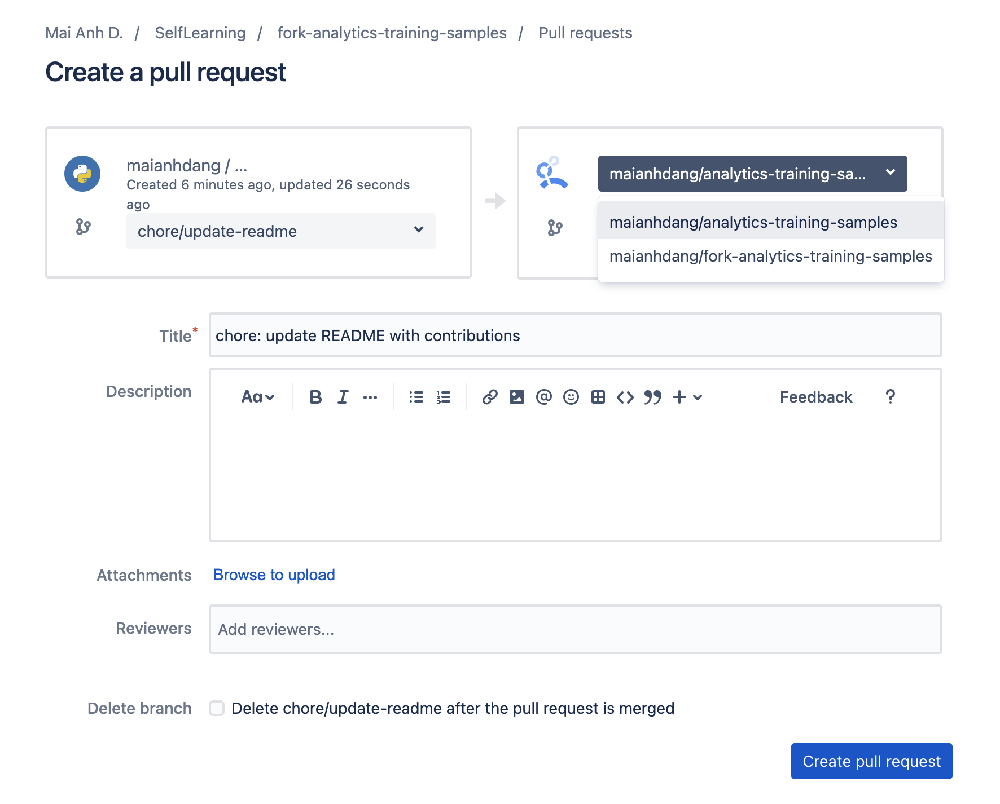

### Contribution ###
> Source: Basic workflow [Bitbucket fork a repo](https://support.atlassian.com/bitbucket-cloud/docs/fork-a-repository/)

If you want to contribute any changes to the original repo:
1. Create a new branch and change on local machine. Naming convention: 
    - `feat/<name>` for new features (Commit message: "feat: <message>")
    - `fix/<name>` for hotfix (Commit message: `"fix: <message>"`)
    - `chore/<name>` for chore tasks - typos, small modifications, refactors (Commit message: `"chore: <message>"`)
2. Commit changes
2. Push changes to your remote fork repo
3. Create pull request to original (upstream) repo

Afterwards, the last step: Repo owner will review and merge the pull request.